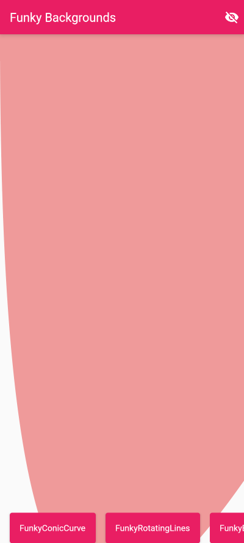
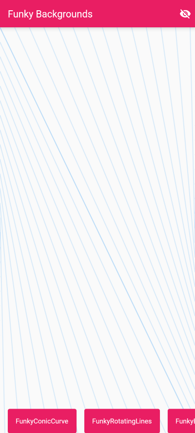
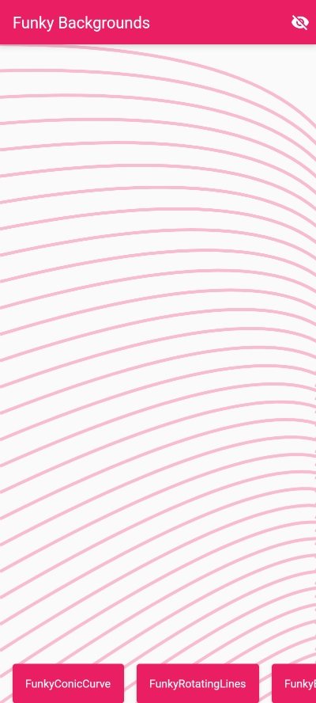
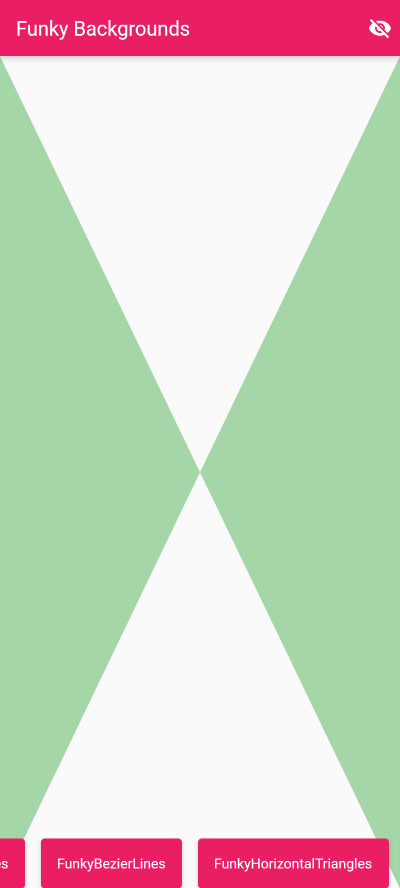
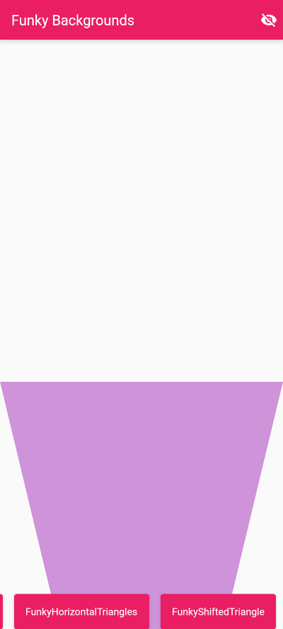
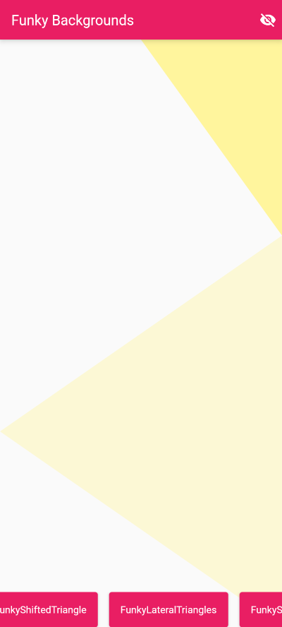
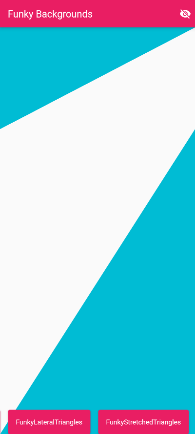

# Funky Backgrounds

A collection of backgrounds made using `CustomPainter` that are funkaayyyyyy.

## How to use

Using funky background is as simple as wrapping view/widget in a `FunkyBackground` and selecting one of the avaiable funky painters.

```dart
return Scaffold(
      body: const FunkyBackground(
        painter: FunkyStretchedTriangles(Colors.cyan),
        child: MyPage(),
      ),
    );
```

## Features

Below you can find screenshots of the available funky painters.

|Conic Curve|Rotating Lines|Bezier Lines|Horizontal Triangles|Shifted Triangle|Lateral Triangles|Stretched Triangles|
|-----------|--------------|------------|--------------------|----------------|-----------------|-------------------|
||||||||

---

### Bugs and Contributions

Found any bug (including typos) in the package? Do you have any suggestion or feature to include for future releases? Please create an issue via GitHub in order to track each contribution. Also, pull requests are very welcome!